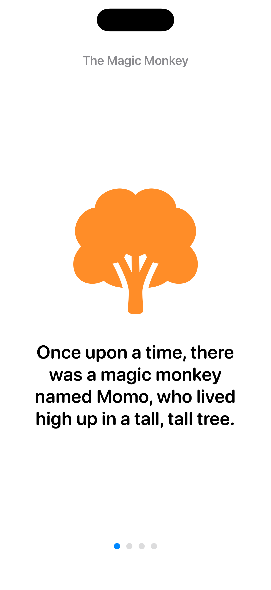
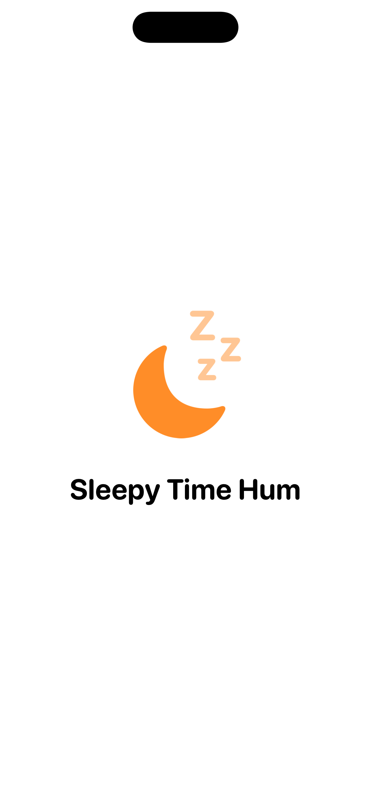

# TapStory

An iPhone that behaves like a screen-free storytelling appliance for
toddlers: the screen is locked and ignores touches, and the only way to
"drive" it is by tapping an NFC tag stuck to a toy or card against the
phone. Tapping a stuffed monkey plays a story about a magic monkey; tapping
a letter card plays that letter's sound and a matching word. Parents can
record their own stories/words in-app and write them onto cheap NFC
stickers, turning literally any toy into a "magic" one.

**By default, the screen doesn't change at all, even while something is
playing.** Tapping a tag plays audio only -- the resting idle screen (a
static grey icon on black) stays exactly as it is, "as if it were not a
screen device." An optional **Screen Display** toggle in Settings turns on
showing the story page, word, or song on screen while it plays, for
whoever wants that -- but audio-only is the default and the whole point.
See **Screen Display: audio-only by default** below.

This repo is a working Xcode project (SwiftUI + CoreNFC), not just a
concept doc. It builds and its unit tests pass; see **Status** below for
exactly what has and hasn't been verified on real hardware.

## Screenshots

<p>
  
  
  
  
</p>

These are captured automatically -- see **Screenshot automation** below --
not mocked up. **The first image is what's actually on screen by default
while any of these is playing** -- the other three show the *optional*
Screen Display mode turned on. More sizes/scenes are under
`docs/screenshots/`.

## Screen Display: audio-only by default

The single most important behavioral decision in this app: tapping a tag
plays audio, full stop. Whether anything is ever *shown* on screen is a
separate, off-by-default choice (`AppSettings.isScreenDisplayEnabled`,
toggled in Dashboard -> Settings -> Screen Display).

- **Off (default):** the idle screen (`IdleTapPromptView`) never changes,
  regardless of what's playing. A `ContentActor`'s view is still mounted
  in the hierarchy -- its `AVAudioPlayer`/`AVSpeechSynthesizer` timing and
  page-auto-advance logic run exactly as normal -- but at `opacity(0)` and
  `allowsHitTesting(false)`, so nothing is visible or tappable. Error
  states (an orphaned tag, a corrupted record) are suppressed the same
  way rather than flashing briefly, and are cleared immediately rather
  than lingering unseen (see `ChildLockedShellView.clearErrorImmediatelyIfHidden()`).
- **On:** the exact same actor views render normally -- this is the mode
  the non-idle screenshots above were captured in.

This was a deliberate correction partway through building this app: an
earlier version always showed story pages/vocab cards/song art on screen,
which was correctly flagged as working against the whole "screen-free"
premise. Keeping both modes on one code path (rather than forking audio
logic away from a separate "visual" path) means the two modes can never
drift out of sync with each other.

## Landing page & App Store pages

`docs/` is a small static site (landing page, Privacy Policy, Terms of
Use, Support/FAQ) meant to satisfy the URLs App Store Connect requires at
submission time, and to eventually be the App's marketing page. It has no
build step and no external dependencies (no CDN fonts, no analytics --
matching the app's own no-tracking stance), so it's just plain HTML/CSS
under `docs/`:

```
docs/
  index.html      # Landing page (includes the screenshot gallery)
  privacy.html    # Privacy Policy (App Store Connect requires this URL)
  terms.html      # Terms of Use / EULA
  support.html    # Support page + FAQ (App Store Connect requires this URL too)
  screenshots/    # Output of Scripts/capture_screenshots.sh
  assets/style.css
```

`.github/workflows/deploy-pages.yml` publishes `docs/` to GitHub Pages
automatically on every push to `main` that touches `docs/`. Once GitHub
Pages is enabled for this repo (Settings -> Pages -> Source: GitHub
Actions), the site is live at
`https://tianhaoz95.github.io/TapStory/`.

**Before submitting to the App Store:** the Privacy Policy and Terms of
Use are accurate drafts (they describe this codebase's actual behavior --
no network calls, no third-party SDKs, local-only storage) but are not a
substitute for legal review. Replace the placeholder `support@tapstory.app`
contact address, and have both pages reviewed by a lawyer before treating
them as final.

## Screenshot automation

`Scripts/capture_screenshots.sh` produces every image under
`docs/screenshots/` with no manual interaction and no XCUITest gesture
scripting:

```sh
./Scripts/capture_screenshots.sh
```

It builds the app, boots one simulator per required App Store screenshot
size class (currently "iPhone 17 Pro Max" for 6.9" and "iPhone 11 Pro Max"
for 6.5" -- adjust the list at the top of the script if Apple's
requirements change), and for each of a handful of "scenes" (idle screen,
a story, a vocab card, a lullaby, the parent dashboard) launches the app
with an environment variable that a `#if DEBUG`-only hook
(`ScreenshotAutomation.swift`) reads on launch to jump straight into that
state -- reusing the same debug mechanism as `DebugSimulateTapButton`,
since CoreNFC can't be exercised in the Simulator at all. This is
dramatically more reliable than scripting actual taps, and, being
`#if DEBUG`-gated, has zero footprint in a Release build.

Since Screen Display defaults to off, a content scene also force-enables
it (only on the simulator taking the screenshot, never on a real device)
so the capture actually shows the optional visual mode instead of an
idle screen that looks identical to the "idle" scene's own screenshot.

## Why this shape

- **No accounts, no network, no analytics.** Everything -- bundled sample
  content, custom recordings, the parent's tag library -- lives in local
  app storage. There is nothing to leak and nothing that requires an
  internet connection to work in a car or at a grandparent's house.
- **The screen lock is app-level, not OS-level.** TapStory cannot turn on
  Guided Access itself (no app can -- see below); it locks itself by
  simply not putting anything tappable in front of the child except an
  invisible parent-gate hotspot. Guided Access is what removes the Home
  gesture / App Switcher / other apps on top of that.
- **The schema is deliberately open**, not hardcoded to "story" and
  "vocab card": every piece of content is `{ "type": "...", "payload":
  {...} }`, and an `ActorRegistry` dispatches `type` to whichever
  `ContentActor` claims it. Adding a brand-new kind of activity later is a
  new actor conformance, not a rewrite. See **Schema & extensibility**.
- **A physical tag stores only a small id, never the content.** The
  content itself (a story's pages, a vocab word's audio, all of it) lives
  in the phone's local library, addressed by that id. This means tag
  capacity is a complete non-issue -- even the cheapest NFC sticker fits a
  UUID -- at the deliberate cost of a tag only meaning something on the
  phone that wrote it. See **Design tradeoff: tags point at your phone's
  library**.

## Status (what's real vs. what needs a physical device)

| Area | Status |
|---|---|
| Project builds (`xcodebuild ... build`) | ✅ Verified, iOS Simulator SDK |
| Unit tests (`xcodebuild ... test`) | ✅ 32/32 passing |
| Idle/locked shell renders correctly | ✅ Verified via Simulator screenshot |
| Screen Display off (default) truly shows no visual change while content plays | ✅ Verified via Simulator screenshot -- see **Screen Display: audio-only by default** |
| On-device speech synthesis (`AVSpeechSynthesizer`) | ✅ Works in Simulator too (unlike CoreNFC) -- this is the default authoring path |
| NFC read/write | ⚠️ **Cannot be exercised on the Simulator** -- CoreNFC requires a physical iPhone 7 or later. Code compiles against the real API; behavior needs to be verified on-device. |
| Guided Access flow | ⚠️ Requires a physical device (Guided Access isn't meaningful in Simulator) |
| Parent-gate long-press, full create-tag flow, audio recording | ⚠️ Built and code-reviewed, but not exercised end-to-end by an automated UI test (long-press + multi-step flows are impractical to script against the Simulator without XCUITest, which wasn't set up in this pass) |
| Bundled lullaby audio | ⚠️ Placeholder text-to-speech (macOS `say`), not real music -- see **Bundled sample content** |

**Bottom line:** the architecture, schema, NFC read/write code, and every
screen are implemented and compiling/passing tests, but this has not yet
been run on a real iPhone with real tags. That's the next step before
handing this to an actual toddler.

## Project layout

```
project.yml                     # xcodegen spec -- TapStory.xcodeproj is generated, not committed
App/TapStory/
  TapStoryApp.swift              # @main entry point
  Core/                          # Schema, actor registry, NFC-agnostic business logic
    JSONValue.swift               # Open JSON payload type
    ContentRecord.swift            # { schemaVersion, type, payload } -- the real content
    TagReference.swift             # { schemaVersion, id } -- the tiny id actually written to a tag
    ContentActor.swift             # Protocol every activity type conforms to
    ActorRegistry.swift            # type string -> ContentActor dispatch table
    MediaRef.swift / MediaResolver.swift   # bundled/recording/on-device-speech indirection
    RecordingStore.swift           # On-device storage for parent voice recordings
    TagLibraryStore.swift          # Parent's "My Tags" library -- what every tag id resolves against
    BundledLibrary.swift           # Loads the sample stories/cards/song for the picker UI
    AudioPlaybackController.swift  # Plays a MediaRef via AVAudioPlayer or AVSpeechSynthesizer
    PlaybackCoordinator.swift      # Resolves NFC tag ids -> content -> whatever the shell shows
    AppSettings.swift              # Screen Display toggle (off by default), UserDefaults-backed
  Actors/Story, Actors/Vocab, Actors/Music/   # The three built-in ContentActor conformances
  NFC/                            # CoreNFC-specific code (kept isolated from Core)
    NFCReaderService.swift          # Continuous NDEF read session for the child shell
    NFCWriterService.swift          # Writes a TagReference (just an id) to a blank/reusable tag
    TagReference+NDEF.swift         # TagReference <-> NFCNDEFPayload bridging
  UI/
    Child/            # What the toddler sees: idle prompt, locked shell, error state,
                       # ScreenshotAutomation.swift (#if DEBUG launch-argument scene driver)
    ParentGate/        # Invisible long-press hotspot + math-question challenge
    Dashboard/          # Parent's home screen: tag library, settings, Guided Access help
    CreateTag/          # Multi-step "make a new magic tag" flow (bundled or record-your-own)
    Root/               # App-wide chrome (tint, forced light appearance)
  Resources/BundledContent/   # Sample stories/vocab/music (JSON + generated placeholder audio)
TapStoryTests/            # Unit tests for the schema, NDEF bridging, and actor dispatch
Scripts/generate_sample_audio.sh   # Regenerates the placeholder narration via macOS `say`
```

## Building and running

Requires Xcode (tested with Xcode 26.6) and [xcodegen](https://github.com/yonaskolb/XcodeGen)
(`brew install xcodegen`). The `.xcodeproj` is generated, not committed --
regenerate it any time the project structure or `project.yml` changes:

```sh
xcodegen generate
open TapStory.xcodeproj
```

Or from the command line:

```sh
xcodegen generate
xcodebuild -project TapStory.xcodeproj -scheme TapStory \
  -sdk iphonesimulator -destination 'generic/platform=iOS Simulator' \
  -configuration Debug CODE_SIGNING_ALLOWED=NO build

xcodebuild -project TapStory.xcodeproj -scheme TapStory \
  -sdk iphonesimulator -destination 'platform=iOS Simulator,name=iPhone 17 Pro' \
  -configuration Debug CODE_SIGNING_ALLOWED=NO test
```

**To actually test NFC and Guided Access**, build to a physical iPhone 7 or
later: open the project in Xcode, pick your phone as the run destination,
set your own Team under Signing & Capabilities (bundle id is currently the
placeholder `com.tapstory.TapStory` -- change it to something under your
own Apple ID/team), and run.

## Schema & extensibility

The actual content behind a tag is one JSON envelope, kept in the phone's
local library (`TagLibraryStore`) -- never on the physical tag itself
(see **Design tradeoff** below for why):

```json
{
  "schemaVersion": 1,
  "type": "story",
  "payload": { "...": "actor-specific shape" }
}
```

`type` is looked up in `ActorRegistry`, which hands the matching
`ContentActor` the whole record. The actor decodes `payload` into its own
strongly-typed struct and produces the full-screen SwiftUI view. Nothing
else in the app -- not the NFC read path, not the tag-writing flow, not the
"choose a type" authoring screen -- has a hardcoded list of types; they all
read from `ActorRegistry.shared.allActorTypes`.

**To add a new activity type** (a counting game, a "leave a voice memo for
grandma" button, anything): create a `FooPayload: Codable` struct, a
`FooActor: ContentActor` with a `typeIdentifier`/`displayName`/
`iconSystemName` and a `makeChildView`, and register it in
`ActorRegistry.registerBuiltInActors()`. It will automatically show up in
the "create a new tag" type picker and in the NFC read dispatch.

### Built-in types

| `type` | Payload shape | Behavior |
|---|---|---|
| `story` | `{ title, pages: [{ caption, symbol, audio }] }` | Auto-advances page by page as each clip finishes; no taps needed |
| `vocab_card` | `{ title, word, letter?, symbol, audio }` | Plays the word's audio twice, then returns to idle |
| `music` | `{ title, symbol, audio, loop }` | Plays once or loops until a new tag is tapped |

`audio` everywhere is a `MediaRef`: `{ "source": "bundled"|"recording"|"speech", "ref": "..." }`.
- `bundled` resolves to a file shipped in the app.
- `recording` resolves to a parent's on-device voice recording, addressed by UUID.
- `speech` holds literal text, spoken live via on-device `AVSpeechSynthesizer`
  at playback time -- nothing is pre-rendered or stored as a file. This is
  the default, easiest authoring path: type a sentence instead of
  recording audio. A **blank** `speech` ref means "speak this item's own
  caption/word/title instead" (`AudioPlaybackController.resolvingBlankSpeechRef`)
  so a story page's narration doesn't have to be typed twice when it
  matches the on-screen text -- see the bundled sample stories for this
  pattern in practice.

Recording your own voice remains fully available (`AudioSourceInput` in
the authoring UI offers both as a segmented choice) for anyone who wants a
story told in a real voice, or for singing/humming, which `speech` can't do.

## Turning a toy into a magic toy (the parent flow)

1. Long-press the invisible hotspot in the bottom-right corner of the
   locked screen for 3 seconds (see **Parental gate** below).
2. Solve the simple math question to open the parent dashboard.
3. **Create a New Magic Tag** -> pick a type (Story / Vocab Card / Music)
   -> either pick something from the bundled library, or **Record Your
   Own** (type the word/title, pick an SF Symbol illustration, then either
   type what should be said -- spoken on-device, no recording needed -- or
   record your own voice).
4. This saves the content to **My Tags** under a fresh id, then **Write
   Tag**: hold a blank or reusable NFC sticker to the top of the phone.
   Only that small id gets written -- see **Design tradeoff** below --
   so any cheap sticker works regardless of how long the story is.
5. Stick the tag to the toy or card. Done -- since the content lives in
   the library rather than on the tag, a lost or destroyed sticker is
   never a real loss: just write the same entry's id to a new one from
   "My Tags."

## Design tradeoff: tags point at your phone's library

A physical tag stores only a `TagReference`: `{ "schemaVersion": 1, "id":
"<uuid>" }`. Tapping it reads that id, and `PlaybackCoordinator` looks it
up in this phone's `TagLibraryStore` to get the actual content. This was a
deliberate redesign (an earlier version of this app wrote the full
content to the tag) because it makes physical tag capacity a complete
non-issue -- even the cheapest NTAG213 sticker fits a UUID string
comfortably, no matter how many pages a story has.

The cost: **a tag only means something on the phone whose library still
has that id.** Concretely:
- Deleting a "My Tags" entry, or using "Erase All My Tags & Recordings" in
  Settings, orphans every physical tag that pointed at it -- both places
  warn about this now, but there's no undo.
- A tag written on one phone/install won't resolve on another, since
  there's no accounts or sync (by design -- see **Why this shape**).
  Restoring the same phone from an iCloud/iTunes backup should carry the
  local library over with it, but a fresh reinstall or a different phone
  will not.
- **Test / Inspect a Tag** in the dashboard (`NFCTagInspectorView`) shows
  exactly this: scanning an orphaned tag reports "not in this phone's `My
  Tags` library" rather than silently doing nothing.

Buy **NTAG21x** stickers (widely sold for exactly this kind of DIY-tag
project) -- any capacity, NTAG213 included, is more than enough now.

## Guided Access (why it's manual, and how to set it up)

Apple does not provide any API for an app to turn on Guided Access itself
-- it's deliberately kept under the parent's direct, physical control (a
triple-click of the side button, and a separate Guided Access passcode).
TapStory can't automate this, and the in-app **Guided Access Setup**
screen (Dashboard -> Guided Access Setup) walks through the one-time setup
and the per-session ritual instead. This is a real, permanent constraint
of the platform, not a v1 gap -- see the `GuidedAccessHelpView` for the
exact steps to hand to a parent.

The one thing CoreNFC does *not* let an app suppress is its own small
system sheet that appears while a scan session is active. TapStory treats
this as an accepted, unavoidable part of the experience rather than
something to fight -- see `NFCReaderService.swift` for the reasoning and
how the continuous-listening session auto-restarts (including if a
toddler taps the sheet's own Cancel/Done button).

## Parental gate

A 3-second long-press on an invisible corner hotspot opens a simple
addition question (`ParentGateChallengeView`) before the dashboard is
reachable. This isn't meant to stop a determined adult -- it exists so a
toddler can't stumble into settings, tag creation, or NFC writing, which
is the standard pattern in kids' apps.

## Bundled sample content

Ships with 5 stories and 10 alphabet vocab cards so the app isn't silent
on first run (`App/TapStory/Resources/BundledContent`). Their narration
uses `MediaRef(source: .speech, ...)` -- spoken live, on-device, from the
text in their JSON -- the same mechanism a parent's own typed content
uses, so these double as a working demo of that path.

The one exception is the lullaby placeholder, which is a real (if
synthetic) `.m4a` file: `AVSpeechSynthesizer` can speak words but can't
sing or hum, so music content still needs an actual audio file. That one
file is macOS `say` text-to-speech, not real music -- regenerate it with:

```sh
./Scripts/generate_sample_audio.sh
```

Before this goes anywhere near an actual toddler, replace the lullaby with
real recorded/composed music, and consider real illustrations in place of
SF Symbols. Illustrations currently use SF Symbols rather than
artwork/photos specifically to avoid needing camera or photo-library
permissions in a kids' app -- see **Ideas for follow-up work**.

The letter-A card's icon uses the system Apple logo glyph as a stand-in
for "apple the fruit" (SF Symbols has no dedicated fruit icon) -- worth
swapping for real artwork before shipping.

## Known limitations / product risks to keep in mind

- **Guided Access requires the parent to physically start it every
  session** (triple-click + tap Start). There's no way around this on
  iOS; the app can only make the instructions as clear as possible.
- **The system NFC sheet is unhideable.** A curious toddler could tap its
  Cancel/Done button; the reader service is written to always silently
  restart listening when that happens, but it's worth watching for in
  real use.
- **NFC hardware requires iPhone 7 or later.** `NFCAvailability.isSupported`
  surfaces a friendly message if run on an unsupported device, but there's
  no fallback interaction model.
- **Deleting library content orphans physical tags.** Since tags store
  only a reference id (see **Design tradeoff**), there is no way to
  recover a tag's content after its library entry is deleted -- both
  delete confirmations warn about this, but it's a real, permanent loss
  with no undo, unlike traditional "delete" actions that only remove a
  convenience view onto data stored elsewhere.
- **On-device speech quality varies by device/OS voice.** `.speech`
  content uses whatever system voice is installed (`AVSpeechSynthesisVoice(language: "en-US")`);
  a parent can get noticeably better results by downloading an
  Enhanced/Premium voice under Settings > Accessibility > Spoken Content.
- **App Store submission** (since "eventually" was the stated goal): kids
  category apps get extra review scrutiny, particularly around anything
  that resembles restricting normal iOS navigation (TapStory doesn't
  actually do this -- it just declines to put anything else on screen --
  but be ready to explain that clearly in review notes), microphone usage
  (already justified via `NSMicrophoneUsageDescription`), and the general
  kids-category privacy requirements (no ads, no third-party analytics,
  no data collection -- this app already has none of that, which should
  make review comparatively easy).

## Ideas for follow-up work

- Sync `TagLibraryStore` via iCloud (still no third-party accounts/servers)
  so a tag survives a reinstall or works from a second family phone --
  the real fix for the **Design tradeoff** section's biggest downside.
- Real recorded/composed music to replace the lullaby TTS placeholder.
- Optional camera-captured photo illustrations (would need
  `NSCameraUsageDescription`/`NSPhotoLibraryUsageDescription` and extra
  privacy review consideration -- deliberately deferred).
- A "counting game" or "shape matching" actor to prove out the schema's
  extensibility with something genuinely interactive rather than
  linear-playback.
- XCUITest coverage of the parent-gate long-press and create-tag flow,
  which today are verified by build + manual reasoning but not automated
  end-to-end.
- On-device (physical iPhone) verification pass for NFC read/write and
  Guided Access, since none of that is exercisable in the Simulator.
